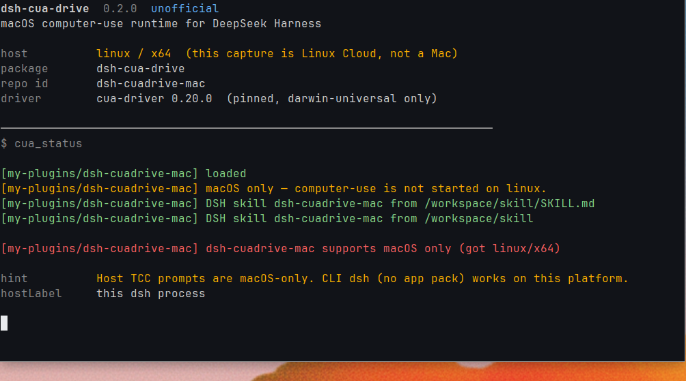

[中文](README.md) · English

# dsh-cua-drive

```sh
dsh plugin --profile web add github:aa2246740/dsh-cuadrive-mac
```

[`pnpm`](https://pnpm.io) must be on `PATH`. Then restart that Host and reload the page.

If `dsh` is not on `PATH`:

```sh
npx @deepseek-ai/dsh plugin --profile web add github:aa2246740/dsh-cuadrive-mac
```

Official `dsh plugin add` runs pnpm in `$DSH_HOME/profiles/web`. This package declares `dsh.bundle.patch`, so it joins `dsh.profile.bundles`. The repo ships built `lib/`; a GitHub install does not run `prepare`. `dsh plugin add` writes the profile only. It does not hot-load a running Host.

macOS only. After install, the in-host agent uses a private, lock-pinned [`cua-driver`](https://github.com/trycua/cua) **0.20.0** (`runtime-lock.json`) to click windows, read the screen, and drive apps. It runs on this plugin's own socket and does not stop, change, or hijack a Cua install already on the machine.

First launch asks the process that started dsh for Accessibility and Screen Recording. DSH.app: grant **DSH**. CLI `dsh web`: grant Terminal / iTerm / Cursor / VS Code. Windows and Linux only load `cua_status` and say this is macOS-only. They do not download a driver or start computer-use.

The package name is `dsh-cua-drive`. The repo is still `dsh-cuadrive-mac`, so existing downloads, permissions, sockets, and sessions do not move.

A local clone uses the same official CLI:

```sh
git clone https://github.com/aa2246740/dsh-cuadrive-mac.git
dsh plugin --profile web add ./dsh-cuadrive-mac
```

Then restart that Host and reload the page.

```sh
dsh plugin --profile web remove dsh-cua-drive
```

DSH.app's Plugin Manager accepts npm package specs only, not `github:`. Desktop users should install into the `web` profile with `dsh web`.

If an older profile `cordis.patch.yml` already has a `dsh-cuadrive-mac` row, delete that row first. The bundle now owns the Loader. Two copies fail boot with a duplicate id.

## First launch on a Mac

| How you run dsh | Grant in System Settings |
|---|---|
| DSH.app | DSH |
| CLI `dsh web` with no app pack | Terminal / iTerm / Cursor / VS Code, the parent app |

Do not run `cua-driver permissions grant`. That pulls `/Applications/CuaDriver.app`. Grant the name in `cua_status.hostPermissions.hostLabel`.

The first Mac start needs network once, to pull the pinned darwin-universal tarball into `$DSH_HOME/dsh-cuadrive-mac/vendor/`. If that fails, set `HTTPS_PROXY` / `ALL_PROXY` / plugin config `proxy`, or drop the same tarball at `runtime.manualCachePath`. Do not run `cua-driver update`.

Progress is the `cua_status` card title, or `$DSH_HOME/dsh-cuadrive-mac/status.json` and `download.log`.

Windows / Linux only load the status tool:



Private runtime lives under `$DSH_HOME/dsh-cuadrive-mac/`. Closing DSH stops only `run/driver.sock`. Tools exposed to the model stay named `cua_*`.

## Config

| key | default | meaning |
|---|---|---|
| `binary` | empty | Absolute override. Empty uses the plugin vendor dir |
| `ownDaemon` | `true` | Private DSH socket |
| `socketPath` | `$DSH_HOME/dsh-cuadrive-mac/run/driver.sock` | Serve for DSH only |
| `autoStart` | `true` | Download and `serve --embedded` if the socket is down |
| `proxy` | empty | HTTP(S) proxy for GitHub downloads |
| `promptPermissions` | `true` | Ask the host that launched dsh on first use |
| `timeoutMs` | `90000` | Per-call timeout |
| `sessionId` | `dsh` | Hosted session on the private daemon |

## Local development

Clone this repo on its own, then mount it with official `dsh plugin add`:

```sh
npm ci
npm test
npm run typecheck
npm run build
dsh plugin --profile web add .
```

Restart that Host and reload the page after a rebuild.

MIT.
